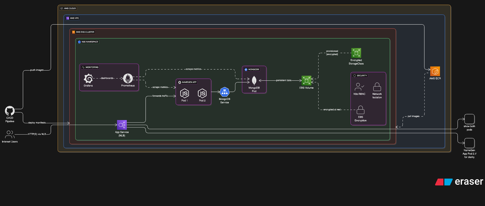
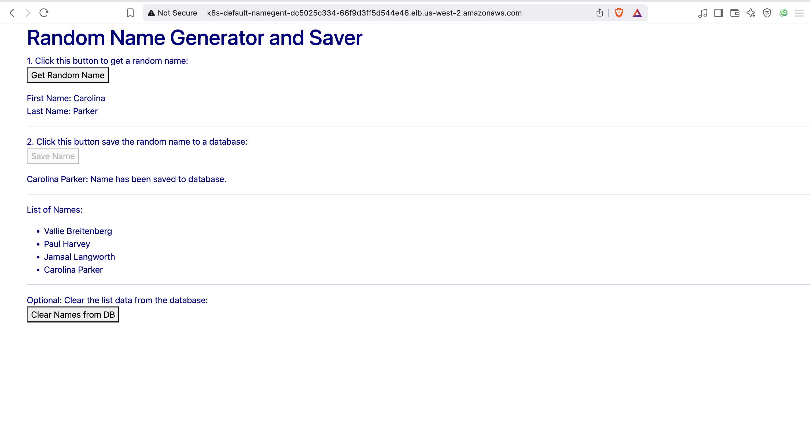
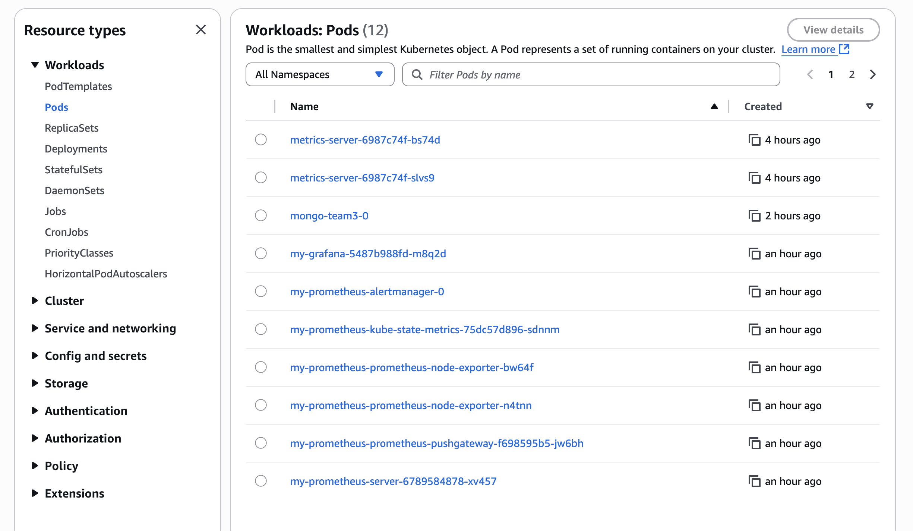
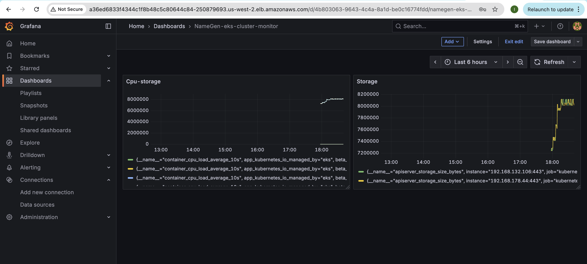
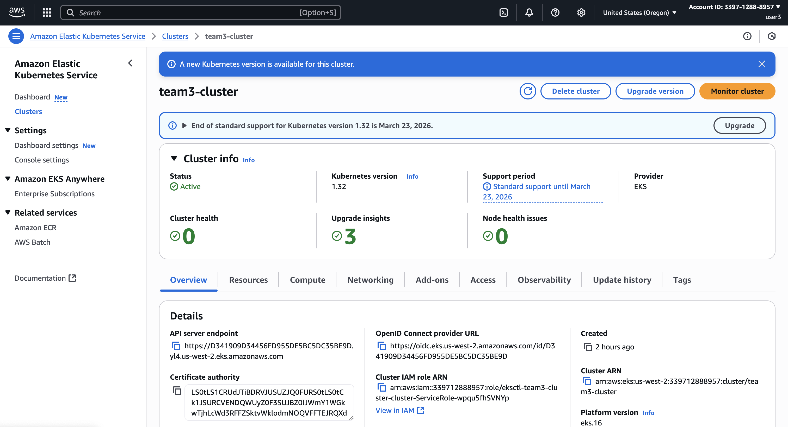

# DEVOPS FINAL PROJECT - TEAM 3

## 📖 Overview

A cloud-native name generation application demonstrating modern DevOps practices and container orchestration. This project showcases a complete CI/CD pipeline, infrastructure as code, and comprehensive monitoring using industry-standard tools and practices.

## 🏗️ Architecture

### System Architecture Diagram


### Application Flow
1. **Frontend**: HTML/CSS/JavaScript served statically
2. **Backend**: Node.js Express API with REST endpoints
3. **Database**: MongoDB for persistent storage
4. **Load Balancer**: AWS Network Load Balancer for traffic distribution
5. **Monitoring**: Prometheus + Grafana for metrics and visualization

## 🛠️ Technologies Used

### Core Application Stack
- **Runtime**: Node.js 18 LTS
- **Framework**: Express.js
- **Database**: MongoDB 3.6
- **Data Generation**: Faker.js
- **Logging**: Winston

### DevOps & Infrastructure
- **Containerization**: Docker with multi-stage builds
- **Container Registry**: AWS ECR (Elastic Container Registry)
- **Orchestration**: Kubernetes (AWS EKS)
- **Cloud Provider**: Amazon Web Services (AWS)
- **Infrastructure as Code**: eksctl for cluster provisioning
- **Storage**: AWS EBS (Elastic Block Store) with GP3 volumes

### Kubernetes Strategy
- **Deployment Strategy**: Rolling updates for zero-downtime deployments
- **Application Pods**: Deployment with 2 replicas for high availability
- **Database**: StatefulSet for MongoDB with persistent storage
- **Service Mesh**: Kubernetes-native service discovery
- **Storage Class**: Custom EBS-backed storage with encryption
- **Load Balancing**: AWS Network Load Balancer (NLB) with IP mode

### Monitoring & Observability
- **Metrics Collection**: Prometheus
- **Visualization**: Grafana dashboards
- **Application Logging**: Winston with structured logging
- **Health Checks**: Kubernetes liveness and readiness probes

### Security Features
- **Container Security**: Non-root user execution
- **Storage Encryption**: EBS volumes encrypted at rest
- **Network Security**: AWS VPC with proper subnet isolation
- **RBAC**: Kubernetes Role-Based Access Control

## 🚀 How to Run - Step by Step

### Prerequisites
- AWS CLI configured with appropriate permissions
- kubectl installed and configured
- eksctl installed
- Docker installed (for local development)

### Step 1: Create EKS Cluster
```bash
# Create the EKS cluster using the provided configuration
eksctl create cluster -f clusters/team3_cluster.yaml

# Verify cluster creation
kubectl get nodes
```

### Step 2: Configure kubectl Context
```bash
# Update kubeconfig to use the new cluster
aws eks update-kubeconfig --region us-west-2 --name team3-cluster
```

### Step 3: Deploy Storage Class
```bash
# Apply the custom storage class for persistent volumes
kubectl apply -f k8s_manifests/storage_svc.yaml
```

### Step 4: Deploy MongoDB Database
```bash
# Deploy MongoDB StatefulSet and Service
kubectl apply -f k8s_manifests/db_deployment.yaml
kubectl apply -f k8s_manifests/db_srvc.yaml
```

### Step 5: Deploy Application
```bash
# Deploy the application deployment and service
kubectl apply -f k8s_manifests/app_deployment.yaml
kubectl apply -f k8s_manifests/app_srvc.yaml
```

### Step 6: Verify Deployment
```bash
# Check all pods are running
kubectl get pods

# Get service details and external IP
kubectl get services

# Check deployment status
kubectl get deployments
kubectl get statefulsets
```

### Step 7: Access the Application
```bash
# Get the LoadBalancer external IP
kubectl get service namegen-team3-service

# The application will be available at:
# http://<EXTERNAL-IP>/
```

## 📊 Monitoring Setup

### Prometheus + Grafana Integration

#### Deploy Prometheus
```bash
# Add Prometheus Helm repository
helm repo add prometheus-community https://prometheus-community.github.io/helm-charts

# Install Prometheus
helm install my-prometheus prometheus-community/prometheus --version 27.30.0

```

#### Deploy Grafana
```bash
# Add Grafana Helm repository
helm repo add grafana https://grafana.github.io/helm-charts

# Install Grafana
helm install my-grafana grafana/grafana --version 9.3.2
```


## 📸 Screenshots

### Application Interface

*Main application interface showing the name generation functionality*

### Kubernetes Dashboard

*Kubernetes dashboard showing running pods and their status*

### Grafana Monitoring

*Grafana dashboard displaying application and infrastructure metrics*

### AWS EKS Cluster

*AWS EKS console showing cluster details and node groups*

## 🔧 Configuration

### Environment Variables
| Variable | Description | Default |
|----------|-------------|---------|
| `MONGODB_URL` | MongoDB connection string | `mongodb://mongo-team3:27017/namegen` |
| `PORT` | Application port | `8080` |
| `NODE_ENV` | Environment mode | `production` |

### Kubernetes Resources
| Resource | Replicas | CPU Request | Memory Request |
|----------|----------|-------------|----------------|
| NameGen App | 2 | 100m | 128Mi |
| MongoDB | 1 | 200m | 256Mi |

## 🚨 Troubleshooting

### Common Issues

#### Pods Not Starting
```bash
# Check pod status and events
kubectl describe pod <pod-name>
kubectl get events --sort-by=.metadata.creationTimestamp
```

#### Database Connection Issues
```bash
# Check MongoDB service
kubectl get service mongo-team3
kubectl logs -l app=mongo-team3
```

#### LoadBalancer Not Accessible
```bash
# Check service status
kubectl get service namegen-team3-service
kubectl describe service namegen-team3-service
```


*This project demonstrates enterprise-grade DevOps practices including containerization, orchestration, monitoring, and cloud-native deployment strategies.*